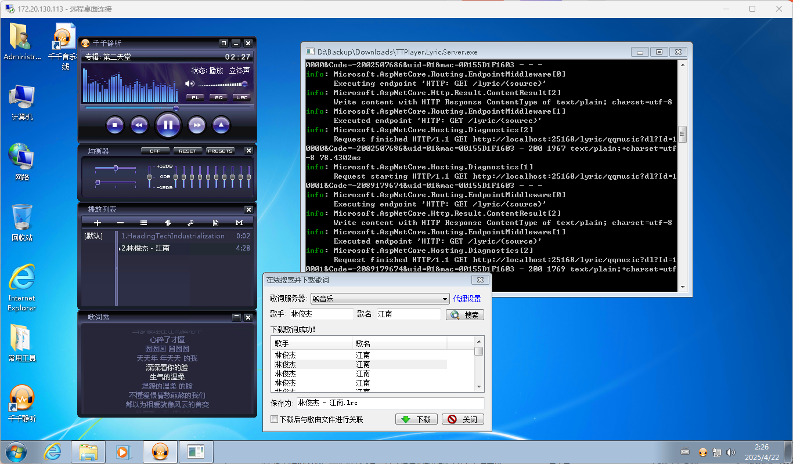

# 千千静听歌词服务器

### 依赖
- asp.net core 9
- [WXRIW/Lyricify-Lyrics-Helper](https://github.com/WXRIW/Lyricify-Lyrics-Helper)
- [Lyricify.Lyrics.Helper-NativeAot](https://github.com/cnbluefire/Lyricify-Lyrics-Helper)
- [VC-LTL](https://github.com/Chuyu-Team/VC-LTL5)

### 编译方式
```
dotnet publish src\TTPlayer.Lyric.Server.csproj -c Release -r win-x64
```

### 关于端口号
默认端口号为 25168  

使用此命令自定义端口号
```
TTPlayer.Lyric.Server.exe --urls=http://*:25168
```

### 服务地址
| service | url |
|--|--|
| netease | http://localhost:25168/lyric/netease |
| qqmusic | http://localhost:25168/lyric/qqmusic |

### 使用方法
[千千静听更换歌词服务器的方法](https://rangotec.com/blog/76.html)

注意需要将 ttp_lrcsh.ini 文件设置为只读

```ttp_lrcsh.ini
<ttp_lrcsvr>
    <server name="网易云音乐" url="http://localhost:25168/lyric/netease"/>
    <server name="QQ音乐" url="http://localhost:25168/lyric/qqmusic"/>
</ttp_lrcsvr>
```

### 预览
